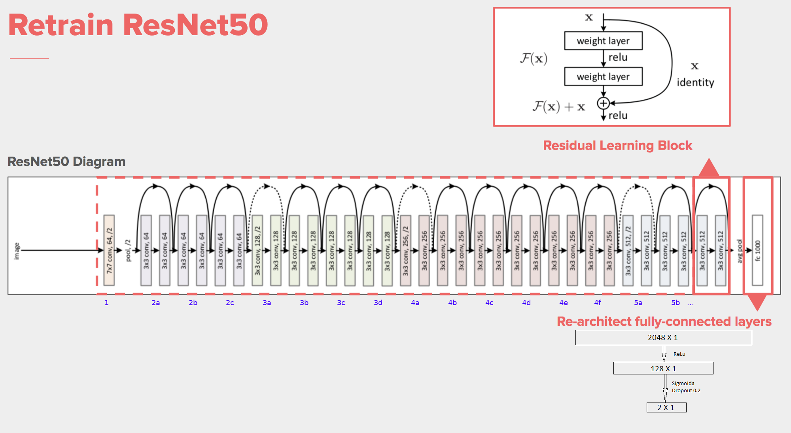

# Лабораторная работа 4

## Архитектура приложения.

Приложение работает в реальном времени, видео поток берётся с камеры с помощью библиотеки opencv. И в цикле берётся отдельный кадр и обрабатывается по следующему алгоритму:  

 

1. Кадр считывается из медиа фала камеры.
2. Кадр передаётся в модель YOLO.
3. У результата вызывается метод crop который возвращён список из словарей, содержащих распознанный объект (вырезанную часть изображения), класс этого объекта и координаты углов рамки.  
4. Из этого результата выверяются объекты класс которых тарелка.
5. К этим изображениям применяется трансформация чтобы привести их к виду для передачи на вход модели классификации.
6. Из преобразованных изображений формируется бач и передаётся модели.
7. На исходным кадре рисуется камка по координатам из результата YOLO.
8. И на исходным кадре пишется текст и результатом классификации.
9. Кадр выводится на экран.

Трансформация в п.5 аналогична преобразованию для дата сета imagenet, поскольку использовалась пред обученная модель на этом дата сете. 
Также имеется гиперпараметр который определяет предельную вероятность, после которой тарелка считается грязной, у данного случая он равен 0.6, подобран опытным путём. 

## Модели.

Для детектирования и первичной классификации объектов используется обученная модель YOLOV5, а именно версия  YOLOV5(small) поскольку это самая быстрая модель если верить данным разработчика, а для работы в реальном времени это самый важный параметр. Сама модель взята с хаба моделей pytorch. 

 

Для классификации тарелок на чистые и грязные используется отдельная модель. Это пред обученная модель ResNet50 с измененными полно-связными (FC) слоями, веса всех слоёв кроме FC фиксируются и следовательно необходимо обучить только FC слои. 

 

Для обучения используется датасет тарелок с сайта kaggle, для тренировок и валидации размечены по 100 грязных и чистых тарелок, каждое 5 изображение используется для валидации, остальное для тренировки. К изображениям для тренировки применяется набор случайных аугментаций для большей эффективности обучения. Обученная модель сохраняется как jit скрипт и загружается уже в основной программе, jit скрипт позволяет не определять модель при загрузке.  

## Характеристики системы.

## Тест.

 

- https://pytorch.org/hub/ultralytics_yolov5/
- https://github.com/ultralytics/yolov5/issues/36
- https://www.aimspress.com/article/doi/10.3934/mbe.2021223?viewType=HTML
