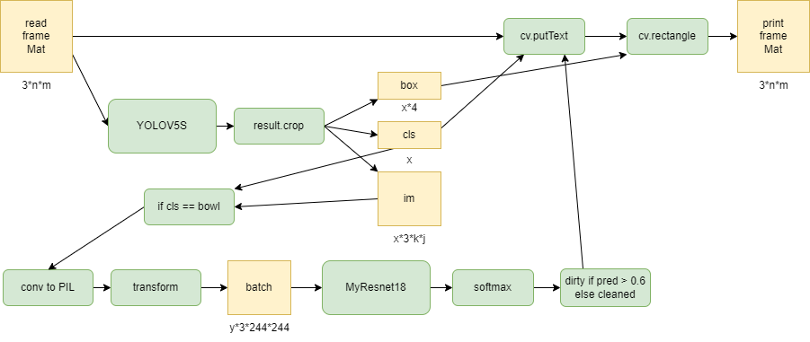
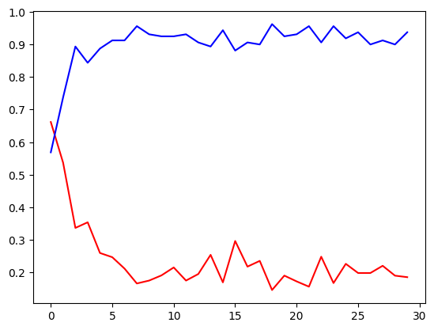

# Лабораторная работа 4

## Архитектура приложения

Приложение работает в реальном времени, видео поток берётся с камеры с помощью библиотеки opencv. И в цикле берётся отдельный кадр и обрабатывается по следующему алгоритму:  

 

1. Кадр считывается из медиа файла камеры.
2. Кадр передаётся в модель YOLO.
3. У результата вызывается метод crop который возвращён список из словарей, содержащих распознанный объект (вырезанную часть изображения), класс этого объекта и координаты углов рамки.  
4. Из этого результата выверяются объекты класс которых тарелка.
5. К этим изображениям применяется трансформация чтобы привести их к виду для передачи на вход модели классификации.
6. Из преобразованных изображений формируется бач и передаётся модели.
7. На исходным кадре рисуется камка по координатам из результата YOLO.
8. И на исходным кадре пишется текст и результатом классификации.
9. Кадр выводится на экран.

Трансформация в п.5 аналогична преобразованию для дата сета imagenet, поскольку использовалась пред обученная модель на этом дата сете. 
Также имеется гиперпараметр который определяет предельную вероятность, после которой тарелка считается грязной, у данного случая он равен 0.5, подобран опытным путём. 

## Модели и их характеристики моделей

Для детектирования и первичной классификации объектов используется обученная модель YOLOV5, а именно версия  YOLOV5(small) поскольку это самая быстрая модель если верить данным разработчика, а для работы в реальном времени это самый важный параметр. Сама модель взята с хаба моделей pytorch. 

 

Для классификации тарелок на чистые и грязные используется отдельная модель. Это пред обученная модель ResNet18 с измененными полно-связными (FC) слоями, веса всех слоёв кроме FC фиксируются и следовательно необходимо обучить только FC слои. 

 

Для обучения используется датасет тарелок с сайта kaggle, для тренировок и валидации размечены по 100 грязных и чистых тарелок, каждое 5 изображение используется для валидации, остальное для тренировки. К изображениям для тренировки применяется набор случайных аугментаций для большей эффективности обучения. Обученная модель сохраняется как jit скрипт и загружается уже в основной программе, jit скрипт позволяет не определять модель при загрузке.  

Loss фикция и accuracy при обучение модели, тренировка и валидация соответственно: 
 
 

Также был проведён тест на 100 новых изображениях из того же дата сета, и получен уровень достоверности предсказания 92 – 93%, в сравнение с ResNet50 у которого 94 - 96%  

## Используемые ресурсы 

Потребление памяти всей программой около 2220 MiB, установлено с помощью утилиты memory_profiler с соответствует моим приблизительным расчётам и данным из мониторинга ресурсов windows. 

Быстродействие программы можно оценить в FPS (кадров, которые программа обрисовывает за секунду).
1.	Без использования модели FPS счётчик показывает 29 – 27 кадров, поскольку входящий поток с камеры установлен на 30 кадров.
2.	При использовании только модели YOLO программа показывает приблизительно 22 - 20 кадров.
3.	При использовании обеих моделей программа показывает приблизительно 16 кадров, в кадре 2 тарелки.

## Тест
Использование программы подразумевает проверку тарелок, едущих по конвейеру, поэтому камера всегда будет расположена свержу, это подразумевает и сама постановка задачи понять, что тарелка грязная можно только посмотрев в неё сверху.  

Окно программы выглядит так:
 

Тестовое видео:
 

Хотелось бы разобрать несколько кейсов из видео описывающих особенностей модели. 
1. Модель плохо классифицирует тарелки с сложным узором или рисунком:  
    
Предположу что модель не может определить разницу между узором и грязью на тарелки. И в видео видно как на этих тарелках часто меняется значение. Возможно в это случае нужно настраивать граничный параметр.  

2. Также замечена особенность что при близком цвете тарелки и фону модели сложно детектировать тарелку. 
 

- https://pytorch.org/hub/ultralytics_yolov5/
- https://github.com/ultralytics/yolov5/issues/36
- https://www.aimspress.com/article/doi/10.3934/mbe.2021223?viewType=HTML
- https://docs.opencv.org/3.4/d8/dfe/classcv_1_1VideoCapture.html
